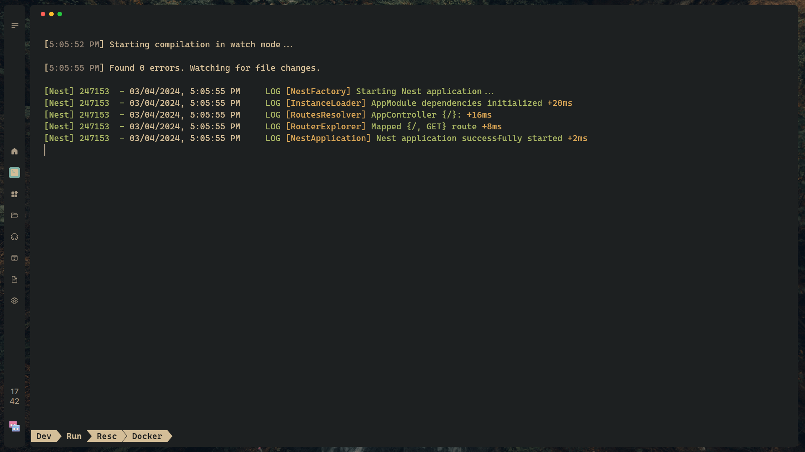

<p align="center">
  <a href="https://github.com/Savecoders" target="blank"></a>
</p>

# TailorShop

This is aproject that contains both the frontend and backend code for our application. The frontend is built using ReactJS and the backend is built using NestJS.

## Repository Structure

The repository is organized as follows:

- `/client`: This directory contains the ReactJS frontend application.
- `/api`: This directory contains the NestJS backend application.
- `/docs`: This directory contains all the project documentation, including requirements, data flow diagrams, state diagrams, and BPMN2 diagrams.

## Getting Started

To get started with development, you'll need to clone the repository and install the dependencies in both the frontend and backend directories.

## Client

```bash
git clone <repository-url>
cd client
# see the README
```

## Api

```bash
cd api
# see the README Api
```
